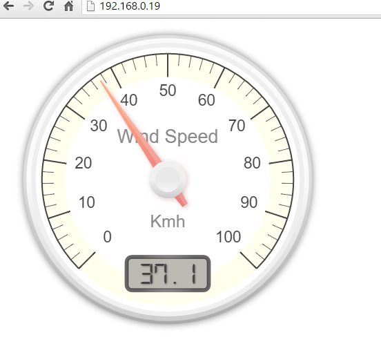

# Anemometer
Wireless WIFI Anemometer using ESP32

|If you find this project useful or interesting, please help support further development!||
|---|---|

|If you find this project useful or interesting, please help support further development!||
|---|---|

This project is based on the ESP32, it works with the Adafruit Anemometer https://www.adafruit.com/?q=anemometer&

|<a href="https://www.aliexpress.com/item/32826540261.html?src=google&src=google&albch=shopping&acnt=494-037-6276&isdl=y&slnk=&plac=&mtctp=&albbt=Google_7_shopping&aff_platform=google&aff_short_key=UneMJZVf&&albagn=888888&albcp=7386552844&albag=80241711349&trgt=743612850714&crea=en32826540261&netw=u&device=c&albpg=743612850714&albpd=en32826540261&gclid=Cj0KCQjw-r71BRDuARIsAB7i_QMqV6A_E4zdDcSiXs2j3qIUm4cIgdCFfkDs1Egmak4QgCXrvfcQXAkaAu2WEALw_wcB&gclsrc=aw.ds"> ESP32 Dev Module</a>||
|---|---|
|<a href="https://www.adafruit.com/?q=anemometer&"> Adafruit Anemometer </a>||

  

## Wiring

Device Pin | ESP32 |
--- | --- |
Anemometer blue (signal) | A0 |
Anemometer brown (+5) | Vin |
Anemometer black (Gnd) | Gnd |

Used the following development tools;

<ul>
  <li>Visual Studio Code with the PlatformIO extension.</li>
</ul>

